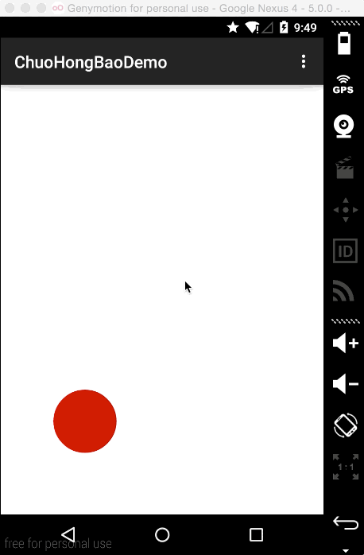

# 支付宝戳红包助手
## 思路
使用monkeyrunner模拟点击事件，用最快的速度点击屏幕的每个角落。

## 演示
如下图，每个红点都代表一次点击事件，为了演示，故意降低了点击频率。



> 目前尚未实战操练，希望大家补充和完善，如：多线程执行

## 项目目标
快速点击屏幕的每个角落，红包命中率100%

## 目录结构
> ChuoHongBaoDemo Android测试工具，可以显示触摸点

> Monkey MonkeyRunner脚本

>> chuohongbao.py 戳红包脚本

> README.md 说明文档

> LICENSE 版权信息

## 使用方法
下载Monkey/chuohongbao.py，然后使用AndroidSDK的monkeyrunner命令运行此脚本，
终端或命令行执行：
```
ANDROID_SDK/tools/monkeyrunner chuohongbao.py
```
运行后的效果是不停的点击屏幕，
为了防止误点其它应用，请先在手机运行ChuoHongBaoDemo这个App
* ANDROID_SDK为AndroidSdk根目录
* monkeyrunner的简单用法可以参见[我的一篇文章](http://www.fatsoon.com/python/2014/07/27/use-monkey-runner.html)
